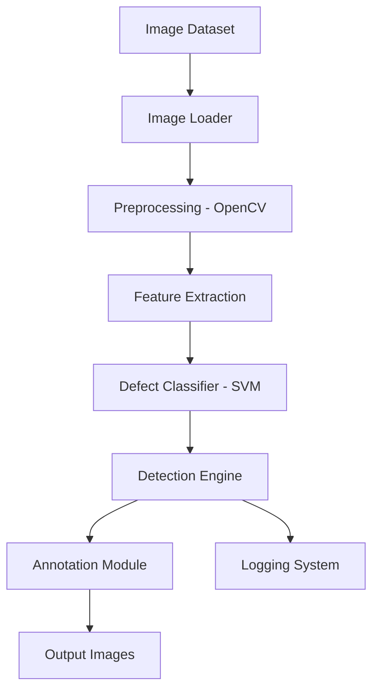

---

# 👁️‍🗨️ Vision Defect Detection System

**Production-Style Computer Vision Pipeline for Automated Surface Defect Detection & Quality Inspection**

[](#)
[](https://python.org)
[](https://pytest.org)
[](https://opencv.org)
[](#core-features)

---

## 🎯 Project Overview

The **Vision Defect Detection System** is a production-style computer vision pipeline designed to simulate industrial quality inspection workflows. It detects surface anomalies such as **scratches, cracks, and structural irregularities** using classical image processing techniques and a lightweight machine learning classifier.

The system demonstrates how real-world manufacturing inspection pipelines are structured, including **image ingestion, preprocessing, feature extraction, defect classification, and annotated output generation**.

This project reflects engineering principles used in automated inspection systems in modern manufacturing environments such as **automotive production and robotics quality assurance systems**.

---

## 🏆 Recruiter Highlights

* 🧠 End-to-End Computer Vision Pipeline (Ingestion → Detection → Output)
* ⚙️ OpenCV-Based Image Processing System
* 📊 Feature Engineering from Contour Analysis
* 🤖 Lightweight ML Classifier (SVM-based defect classification)
* 🧪 Automated Testing with pytest
* 📁 Modular Production-Style Architecture (`src/`)
* 📸 Annotated Output Generation System
* 🔍 Real-world QA Inspection Simulation Logic

---

## 🔥 Core System Features

### 🧪 Vision Processing Engine

```python
def preprocess_image(img):
    gray = cv2.cvtColor(img, cv2.COLOR_BGR2GRAY)
    return cv2.Canny(gray, 50, 150)
```

---

### 🐛 Defect Detection Logic

* Contour-based shape analysis
* Aspect ratio-based scratch detection
* Feature extraction (area, perimeter, solidity)
* ML-based classification (SVM model)

---

### 🤖 Machine Learning Classifier

```python
model = SVC(kernel="linear", probability=True)
model.fit(X, y)
```

Classifies:

* Scratch defects
* Normal surfaces
* Crack-like structures

---

### 📸 Annotation System

* Draw bounding boxes on detected defects
* Save processed images to output folder
* Generate visual QA reports

---

```markdown
## 🏗️ System Architecture



---

## 🛠️ Technology Stack

| Component  | Technology       | Purpose                   |
| ---------- | ---------------- | ------------------------- |
| Language   | Python 3.11      | Core implementation       |
| CV Library | OpenCV           | Image processing pipeline |
| ML Model   | Scikit-learn SVM | Defect classification     |
| Testing    | pytest           | Automated test framework  |
| Data       | NumPy            | Feature representation    |
| Logging    | Python logging   | Event tracking            |
| Format     | Pickle (.pkl)    | Model persistence         |

---

## 🚀 Quick Start Guide

### 📦 Prerequisites

```bash
Python 3.11+
pip
```

---

### ⚙️ Installation

```bash
git clone https://github.com/nwaizugbechukwuebuka/-Vision-Defect-Detection-System.git
cd vision-defect-detection-system

python -m venv venv
venv\Scripts\activate   # Windows

pip install -r requirements.txt
```

---

### ▶️ Run System

```bash
python -m src.main
```

---

### 🧪 Run Tests

```bash
python -m pytest -v
```

---

## 💡 Usage Example

```python
from src.vision.defect_detector import DefectDetector

detector = DefectDetector(config)

defects, annotated = detector.detect(image, image)

print(defects)
```

---

## 📊 Testing & Quality Assurance

### 🔬 Test Coverage Areas

* Image loading validation
* Preprocessing pipeline correctness
* Defect detection accuracy
* Pipeline integration testing

---

### 📈 Quality Metrics

* ✔ End-to-end pipeline functional
* ✔ pytest validation enabled
* ✔ Modular architecture design
* ✔ Real-time defect annotation output

---

## 📁 Project Structure

```
vision-defect-detection-system/
│
├── src/
│   ├── vision/              # Core defect detection logic
│   ├── pipeline/            # Processing pipeline
│   ├── utils/               # Image loader & helpers
│   ├── logging_system/      # Structured logging
│   ├── models/              # ML model (SVM .pkl)
│   └── main.py              # Entry point
│
├── data/
│   ├── samples/             # Input images
│
├── outputs/
│   ├── annotated_images/    # Detection results
│
├── tests/
│   ├── test_detector.py
│   ├── test_pipeline.py
│
├── defect_classifier.pkl
├── requirements.txt
└── README.md
```

---

## ⚙️ Pipeline Flow

1. Load images from dataset
2. Preprocess using OpenCV
3. Extract contour features
4. Classify defects using SVM
5. Annotate detected regions
6. Save output images
7. Log detection events

---

## 🧠 Engineering Value (Manufacturing Alignment)

This project demonstrates concepts aligned with industrial inspection systems used in environments such as:

* Automotive quality inspection lines
* Robotics vision systems
* Automated manufacturing QA pipelines

It reflects real-world workflows similar to those used in **automated defect detection systems in electric vehicle production environments such as Tesla manufacturing lines**.

---

## 🚀 Advanced Engineering Features

* Modular vision pipeline architecture
* Feature-based defect classification
* SVM-based lightweight ML inference
* Structured logging system
* Automated testing with pytest
* Output visualization system

---

## 📚 Documentation

* `src/vision/` → defect detection logic
* `src/pipeline/` → processing workflow
* `src/utils/` → image handling utilities
* `outputs/` → annotated results

---

## 👨‍💻 About the Developer

### **Chukwuebuka Tobiloba Nwaizugbe**

Aspiring **Security Engineering & Computer Vision Engineer**

**Core Focus:**

* Computer Vision Systems
* Machine Learning for Industrial QA
* Secure & Scalable Backend Systems
* Automation & Testing Pipelines

---

<div align="center">

### 👁️‍🗨️ Built for Real-World Computer Vision & QA Engineering Systems

**Bridging Machine Learning, Automation, and Industrial Inspection**

[](https://github.com/nwaizugbechukwuebuka/-Vision-Defect-Detection-System.git)
[]((https://www.linkedin.com/in/chukwuebuka-tobiloba-nwaizugbe/)

</div>

---
